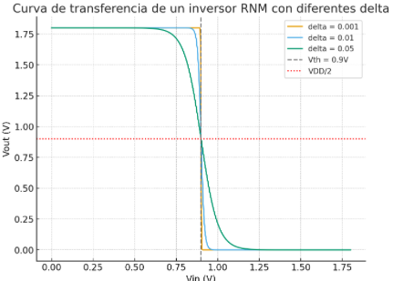
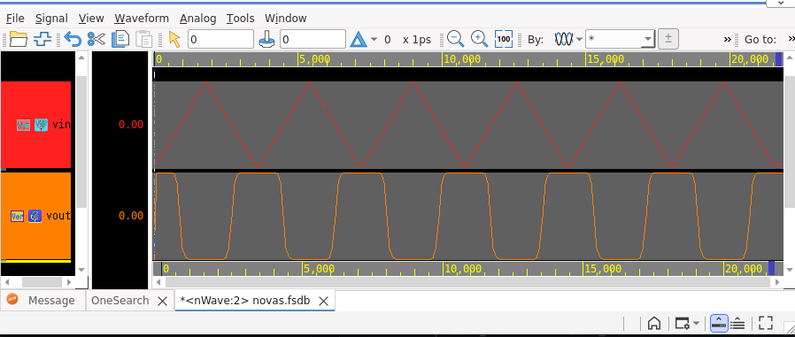

# RNM_gate_inverter

Modelado de un inversor usando una funcion modelo. En este caso una sigmoide que se presenta en la figura de abajo



 Simulacion realizada en Synopsys





### Comando para configurar synopsys usando **Makefile**

```bash
setenv GIT_ROOT `git rev-parse --show-toplevel`
setenv UVM_WORK $GIT_ROOT/work/uvm
mkdir -p $UVM_WORK && cd $UVM_WORK
ln -sf $GIT_ROOT/hw/Makefile/Makefile.vcs Makefile
